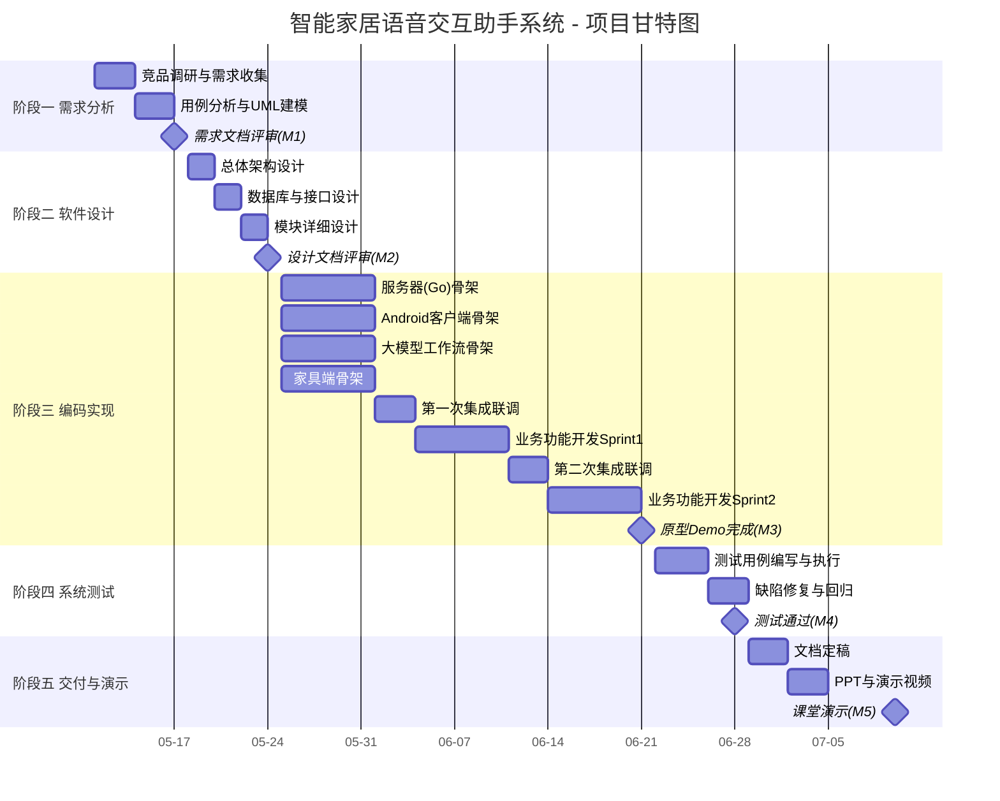

# 《智能家居语音交互助手系统》项目策划文档

| 项目名称 | 智能家居语音交互助手系统 |
|---|---|
| 项目代号 | SmartHome-Voice-Assistant（SHVA） |
| 文档版本 | v1.0 |
| 文档状态 | 草案（Draft） |
| 编写人 | 关梓浩 |
| 编写日期 | 2026-05-08 |
| 审核人 | 全体成员 |
| 适用周期 | 2026-05-11 ~ 2026-07-10（共 8 周） |

---

## 修订历史

| 版本 | 日期 | 修订人 | 修订内容 |
|---|---|---|---|
| v1.0 | 2026-05-08 | 关梓浩 | 初稿，依据课程考核要求编写 |

---

## 1. 项目概述

### 1.1 项目背景

随着大语言模型与物联网技术的融合，"自然语言控制家居"已成为全屋智能的主流交互范式。本项目作为《软件工程》课程实践考核选题方向一"全屋智能系统"的具体落地，旨在以完整的软件工程流程，设计并实现一套**基于大模型指令识别与语音交互的智能家居控制系统**，覆盖需求分析、软件设计、代码实现、系统测试与项目管理五个核心环节。

### 1.2 项目目标

**业务目标**：

1. 用户可通过 Android 客户端使用自然语言（语音或文本）控制家居设备（如开关、灯光、空调温度、窗帘等）。
2. 支持设备绑定、状态查询、场景联动（例如"回家模式"一键开启多设备）。
3. 大模型能够准确识别用户意图，并将其转换为结构化控制指令。

**过程目标（课程考核目标）**：

1. 产出完整四份文档：需求分析、软件设计、测试计划与用例报告、项目管理。
2. 提交可运行的原型系统，至少实现 **3 个完整用例**、**代码源文件 ≥ 5 个**、**关键代码行 ≥ 500 行**，达到课程考核"规模系数=1"的标准。
3. 通过现场演示与录制视频验证系统正确性，测试用例通过率 ≥ 95%。

### 1.3 项目范围

**包含**（In-Scope）：

- 家具端：至少 1 类模拟设备（灯 / 空调 / 窗帘任选），负责接收指令、反馈状态。
- 客户端：Android App，覆盖登录注册、设备绑定、指令下发、语音交互、状态查看。
- 服务器：Go 后端，负责用户管理、设备管理、消息路由、会话存储。
- 大模型工作流：Python 服务，封装 **本地 ASR** → **云端 LLM**（意图识别+指令生成）→ **本地 TTS** 链路。

**不包含**（Out-of-Scope）：

- 真实量产级硬件设备的 OTA 升级与认证。
- 多租户/SaaS 化商业部署能力。
- iOS 客户端、Web 客户端（作为未来扩展方向）。

### 1.4 交付物清单

按课程考核"三、提交材料"的要求，本项目最终交付以下内容：

| 编号 | 交付物 | 格式 | 负责人 | 截止时间 |
|---|---|---|---|---|
| D1 | 需求分析文档 | .md + .docx + UML 原始素材 | 关梓浩 | 2026-05-24 |
| D2 | 软件设计文档 | .md + .docx + UML 原始素材 | 关梓浩 | 2026-06-07 |
| D3 | 测试计划与用例报告 | .md + .docx | 容嘉 | 2026-07-05 |
| D4 | 项目管理文档（本文档） | .md + .docx + 甘特图 | 关梓浩 | 随项目持续更新 |
| D5 | 程序代码 + 测试数据 | 打包 zip，附 README 部署说明 | 林帅 / 马正朗 / 吴承凯 / 刘智冲 | 2026-07-08 |
| D6 | 原型系统演示视频 / 截图 | mp4 / png | 容嘉 | 2026-07-06 |
| D7 | 角色分工及工作情况说明 | .docx | 关梓浩 | 2026-07-08 |
| D8 | 成员心得（每人 ≤ 400 字） | .docx | 全体成员 | 2026-07-08 |
| D9 | 第 17 周 5 分钟课堂演示材料 | PPT | 关梓浩 + 容嘉 | 第 17 周课前 |
| D10 | 15 分钟项目汇报视频 | mp4 | 全体成员 | 第 17 周末 |

---

## 2. 团队组织与分工

### 2.1 团队结构

```
                    项目经理（队长）
                          │
     ┌───────────┬────────┼────────┬───────────┐
     │           │        │        │           │
  服务器组     客户端组  大模型组  家具端组   测试/UI
  林帅       马正朗     吴承凯     刘智冲      容嘉
```

### 2.2 角色职责矩阵

| 角色 | 成员 | 核心职责 | 次要职责 |
|---|---|---|---|
| **项目经理 / 队长** | 关梓浩 | 总体规划、进度跟踪、风险管理、周会主持、对外汇报；参与服务器端开发（用户模块） | 协调跨模块接口、整理文档、主导技术方案评审 |
| **服务器开发** | 林帅 | Go 后端搭建：设备接入网关、指令路由、WebSocket 长连接、MySQL/Redis 持久化 | 编写服务端接口文档、部署运维脚本 |
| **Android 客户端开发** | 马正朗 | Android App 全部页面与业务逻辑：登录/注册、设备绑定、控制面板、语音按钮、会话历史 | 客户端打包、APK 发布、性能优化 |
| **大模型工作流开发** | 吴承凯 | Python FastAPI 服务：本地 ASR/TTS 引擎集成、云端 LLM Prompt 工程、意图识别→结构化指令、对话上下文管理 | LLM Provider 选型对比、Prompt 评测、本地模型性能调优 |
| **家具端开发** | 刘智冲 | 家具端实现（硬件或纯软件模拟）：设备注册、心跳、指令解析、状态上报；协议规范（MQTT/WebSocket）文档 | 配合服务器联调、准备演示用设备 |
| **测试 / UI 设计** | 容嘉 | 测试计划与用例编写、回归测试执行、缺陷跟踪；Android UI 原型图（Figma）、交互规范 | 演示材料、视频剪辑、录屏 |

> **说明**：所有成员均需参与需求分析、设计评审、测试与文档撰写。以上仅为主责分工。

### 2.3 RACI 责任矩阵（关键工作项）

> R=负责(Responsible)，A=批准(Accountable)，C=咨询(Consulted)，I=知会(Informed)

| 工作项 | 关梓浩 | 林帅 | 马正朗 | 吴承凯 | 刘智冲 | 容嘉 |
|---|---|---|---|---|---|---|
| 需求分析文档 | A/R | C | C | C | C | C |
| 总体架构设计 | A/R | R | R | R | R | C |
| 服务器详细设计与编码 | A | R | C | C | C | I |
| 客户端详细设计与编码 | A | C | R | C | I | C |
| 大模型工作流编码 | A | C | C | R | I | I |
| 家具端编码 | A | C | I | I | R | I |
| 接口联调 | A | R | R | R | R | C |
| 测试计划与用例 | A | C | C | C | C | R |
| 测试执行与回归 | A | C | C | C | C | R |
| 项目管理文档 | A/R | I | I | I | I | I |
| 演示 PPT / 汇报视频 | A | C | C | C | C | R |

---

## 3. 项目计划与进度安排

### 3.1 阶段划分（WBS）

项目按软件工程瀑布与迭代结合的方式，划分为 **5 个阶段、8 周**：

| 阶段 | 代号 | 起止时间 | 主要任务 | 里程碑交付物 |
|---|---|---|---|---|
| 阶段一：需求分析 | P1 | W1：05-11 ~ 05-17 | 竞品调研、需求收集、用例分析、UML 建模 | **M1** 需求分析文档 v1.0 评审通过 |
| 阶段二：软件设计 | P2 | W2：05-18 ~ 05-24 | 架构设计、模块详细设计、数据库 ER 图、接口协议 | **M2** 软件设计文档 v1.0 评审通过 |
| 阶段三：编码实现 | P3 | W3 ~ W6：05-25 ~ 06-21 | 四端并行开发，每周一次集成联调 | **M3** 完整原型系统可运行（端到端 Demo） |
| 阶段四：系统测试 | P4 | W7：06-22 ~ 06-28 | 功能/性能/安全/兼容测试、缺陷修复回归 | **M4** 测试报告 v1.0，关键缺陷清零 |
| 阶段五：交付与演示 | P5 | W8：06-29 ~ 07-10 | 文档定稿、PPT 制作、视频录制、课堂演示 | **M5** 课堂演示完成、全部制品提交 |

### 3.2 甘特图（Mermaid）

> 查看方式：VSCode 安装 Markdown Preview Mermaid Support 插件，或粘贴到 [mermaid.live](https://mermaid.live/)。
> 交付时导出 PNG 放入 `docs/images/gantt.png`。



### 3.3 每周例会安排

| 例会 | 时间 | 主持 | 产出 |
|---|---|---|---|
| 周例会 | 每周日 20:00（线上/线下） | 关梓浩 | 周报、下周任务拆解、问题清单 |
| 设计评审会 | 阶段一/二末尾 | 关梓浩 | 评审意见、文档签字版 |
| 集成联调会 | Sprint 末尾 | 林帅 | 联调记录、接口调整 TODO |
| 发布评审会 | W7 末 | 关梓浩 | 发布检查单、Go/No-Go 决议 |

---

## 4. 资源与工具

### 4.1 人力资源

- 6 名组员，全员参与开发；平均每人每周投入约 **10 ~ 12 小时**，项目总工时约 **480 ~ 580 人时**。

### 4.2 软硬件资源

| 类别 | 资源 | 用途 |
|---|---|---|
| 服务器环境 | 本地 Docker / 校园云服务器（2C4G） | 部署 Go 服务、Python 工作流、MQTT Broker |
| 数据库 | MySQL 8.0、Redis 7 | 持久化、缓存、会话存储 |
| 消息中间件 | EMQX / Mosquitto（MQTT 协议） | 家具端接入 |
| 家具端（可选） | ESP32 / 树莓派 / 纯软件模拟器 | 家具设备接入演示 |
| 大模型 API | 通义千问 / 豆包 / DeepSeek 任选 | 云端 LLM 推理（意图识别与自然语言理解） |
| 本地语音引擎 | ASR：FunASR/Whisper；TTS：Edge-TTS/Piper | 语音输入输出，本地部署不走公网 |
| 开发工具 | IDEA/GoLand、Android Studio、VSCode | 编码 |
| 版本管理 | Git + GitHub/Gitee | 代码与文档托管 |
| 项目管理 | GitHub Projects / TAPD / Jira | 任务看板、燃尽图 |
| 文档绘图 | draw.io、PlantUML、Mermaid | UML、甘特图、架构图 |
| 沟通 | 微信群 + 腾讯会议 | 日常沟通与评审 |

### 4.3 仓库与分支策略

- 仓库地址：`https://github.com/<org>/smarthome-voice-assistant`（待创建）
- 分支模型：`main`（受保护，只接受 PR）→ `dev` → `feature/*`、`bugfix/*`
- 代码提交规范：[Conventional Commits](https://www.conventionalcommits.org/)（`feat:` / `fix:` / `docs:` / `test:` …）
- 每个 PR 需至少 **1 名非作者成员** 审核通过，且 CI（lint + 单测）绿灯后方可合入。

---

## 5. 沟通管理

| 沟通方式 | 频率 | 参与方 | 目的 |
|---|---|---|---|
| 微信群（即时） | 每日 | 全员 | 日常问题、任务同步 |
| 站会（可选，线上） | 每周三 21:00 | 全员 | 15 分钟快速同步 |
| 周例会 | 每周日 20:00 | 全员 | 进度、风险、下周计划 |
| 评审会 | 阶段关键点 | 全员 | 文档/代码/发布评审 |
| 1:1 沟通 | 按需 | 关梓浩 ↔ 成员 | 个人障碍、绩效反馈 |

**沟通原则**：

1. **问题 4 小时原则**：任何阻塞超过 4 小时的问题必须在微信群反馈，不得独自硬扛。
2. **文档先行**：接口变更、架构调整先更新文档再写代码。
3. **透明化**：所有决策、会议纪要归档至 `docs/attachments/`。

---

## 6. 风险管理

### 6.1 风险识别与评估

> **影响度 / 概率**：H=高、M=中、L=低；**风险值** = 影响度 × 概率。

| 编号 | 风险描述 | 影响度 | 概率 | 风险值 | 类别 |
|---|---|---|---|---|---|
| R1 | 大模型 API 不稳定、限流或费用超支 | H | M | H | 技术 |
| R2 | 四端接口协议变更频繁，联调成本高 | H | H | H | 技术 |
| R3 | 家具端硬件到货延迟或调试失败 | M | M | M | 资源 |
| R4 | 团队成员期末考试、实习冲突，投入不足 | H | H | H | 人力 |
| R5 | 技术栈多（Go/Android/Python/IoT），学习曲线陡 | M | H | H | 技能 |
| R6 | 语音识别准确率不足，演示效果差 | M | M | M | 产品 |
| R7 | Git 冲突、误删代码导致返工 | M | L | L | 流程 |
| R8 | 需求蔓延（Feature Creep），超出 8 周可完成范围 | H | M | H | 管理 |
| R9 | 文档最后赶工，质量不达标 | M | H | M | 管理 |
| R10 | 演示现场网络/硬件故障 | H | L | M | 运维 |

### 6.2 风险应对策略

| 编号 | 应对策略 | 触发条件 | 责任人 |
|---|---|---|---|
| R1 | ① 预置 2 家以上 LLM 厂商的 Key；② 在代码中抽象 `LLMProvider` 接口，可热切换；③ 费用预算不超过 200 元/人 | API 连续 3 次 5xx 或当日额度用光 | 吴承凯 |
| R2 | ① 接口先出 OpenAPI/Proto 文档再编码；② 服务端提供 Mock Server；③ 接口变更必须 PR + 版本号 | 接口评审后仍有重大改动 | 林帅 |
| R3 | ① 采用"软件模拟器优先、真机为辅"策略，即使硬件到货失败也能演示；② 模拟器与真机遵循同一协议 | 硬件 05-25 未到货 | 刘智冲 |
| R4 | ① 前 6 周完成核心功能，第 7-8 周留作缓冲；② 每人每周至少 1 次推进；③ 关梓浩每周检查投入 | 成员连续 2 周未交付 | 关梓浩 |
| R5 | ① 阶段一预留 2 天"技术预研"；② 结对编程；③ 成员间技术分享会 | 阶段一结束时仍未上手 | 关梓浩 |
| R6 | ① 演示使用"文本输入 + 语音输入"双通道；② 预录 5 段典型语音 Demo 作为兜底 | 演示前联调语音成功率 < 80% | 吴承凯 / 马正朗 |
| R7 | ① 分支保护 + 强制 PR；② 每日 push；③ 每周备份 | 发生误删或冲突 > 30 分钟解决不掉 | 关梓浩 |
| R8 | ① 需求冻结（W2 结束）；② 新需求走变更单流程；③ 采用 MoSCoW 法优先 Must Have | W3 后提出新需求 | 关梓浩 |
| R9 | ① 文档与代码同步提交；② W7 起每周抽查文档；③ 使用统一模板 | 文档更新滞后 > 1 周 | 关梓浩 |
| R10 | ① 提前一天彩排；② 准备离线演示视频；③ 带移动热点/有线网 | 演示日 | 关梓浩 + 容嘉 |

### 6.3 风险监控

- 关梓浩在每周例会对 **风险值 = H** 的风险逐条 review，更新 `docs/attachments/风险台账.xlsx`。
- 新增风险随时登记，关闭风险需注明结论与证据。

---

## 7. 质量管理

### 7.1 质量目标

| 维度 | 目标值 |
|---|---|
| 功能用例通过率（演示场景） | ≥ 95% |
| 关键用例数 | ≥ 3 个，全部通过 |
| 代码源文件数 | ≥ 20 个（远超规模要求的 5 个） |
| 关键代码行 | ≥ 2000 行（远超 500 行门槛） |
| 严重缺陷数（P0/P1） | 交付时 = 0 |
| 代码审核覆盖率 | 100%（所有 PR 必须 review） |
| 单元测试覆盖率（核心模块） | ≥ 60% |

### 7.2 质量保证活动

- **静态检查**：Go 使用 `golangci-lint`；Python 使用 `ruff`；Android 使用 `ktlint`。
- **单元测试**：Go `testing` + `testify`；Python `pytest`；Android `JUnit4`。
- **代码评审（Code Review）**：所有合入 `dev` 的代码必须经过同伴评审。
- **阶段评审（Phase Review）**：每个里程碑前组织内部评审，产出评审报告。
- **文档双人校对**：每份对外交付文档由编写人 + 一名非编写人交叉审核。

### 7.3 配置管理

- 所有代码与文档统一入 Git；**禁止将密钥、账号密码提交** 到仓库。
- 敏感配置统一放入 `.env.example`，真实 `.env` 通过微信群私发。
- 发布版本统一打 Tag：`v0.1-alpha`、`v0.2-beta`、`v1.0-final`。

---

## 8. 进度跟踪与汇报

### 8.1 跟踪指标

- **计划完成率** = 本周计划任务中已完成数 / 本周计划任务总数
- **燃尽图**：GitHub Projects / TAPD 自动生成
- **风险指数变化**：每周例会更新

### 8.2 周报模板

每位成员每周日 18:00 前提交周报，格式如下（不超过 300 字）：

```
# 周报 · 第 X 周（YYYY-MM-DD ~ YYYY-MM-DD）· 姓名

## 本周完成
1. ...
2. ...

## 本周未完成 / 阻塞
- 问题：...
- 原因：...
- 需支持：...

## 下周计划
1. ...
2. ...

## 工时
约 X 小时
```

### 8.3 进度跟踪记录（持续更新）

> 下表在项目执行中由关梓浩每周更新一次。

| 周次 | 计划任务数 | 完成数 | 完成率 | 主要进展 | 主要问题 | 调整措施 |
|---|---|---|---|---|---|---|
| W1 | - | - | - | - | - | - |
| W2 | - | - | - | - | - | - |
| W3 | - | - | - | - | - | - |
| W4 | - | - | - | - | - | - |
| W5 | - | - | - | - | - | - |
| W6 | - | - | - | - | - | - |
| W7 | - | - | - | - | - | - |
| W8 | - | - | - | - | - | - |

---

## 9. 变更管理

任何影响范围、进度、交付物的变更需走以下流程：

1. 提出人在微信群发起变更申请，说明：**变更内容、影响、预计工时**。
2. 关梓浩组织相关成员评估（≤ 24h）。
3. 评估通过后，在 `docs/attachments/变更记录.md` 登记并更新相关文档。
4. 评估不通过，记录原因并归档。

---

## 10. 成功标准

项目成功的判定依据：

1. ✅ 四份文档按时提交，且通过课程考核评分 ≥ 75 分档（中等及以上）。
2. ✅ 原型系统能在现场演示以下三个完整端到端用例：
   - **UC-01** 用户注册登录并绑定一台家具设备。
   - **UC-02** 用户通过语音/文本指令控制设备，设备实时响应并反馈状态。
   - **UC-03** 用户查看历史会话与设备状态。
3. ✅ 代码规模 ≥ 考核最小门槛（5 文件 / 500 行）。
4. ✅ 第 17 周课堂演示与 15 分钟汇报视频如期完成。
5. ✅ 全体成员均提交课程心得，关梓浩提交分工说明。

---

## 附录 A：关键术语表

| 术语 | 说明 |
|---|---|
| ASR | Automatic Speech Recognition，自动语音识别 |
| TTS | Text-to-Speech，语音合成 |
| LLM | Large Language Model，大语言模型 |
| MQTT | 一种轻量级的发布/订阅消息协议，常用于 IoT |
| WBS | Work Breakdown Structure，工作分解结构 |
| RACI | 责任分配矩阵 |
| MoSCoW | 需求优先级方法：Must / Should / Could / Won't |

## 附录 B：参考文档

- [课程官方]《软件工程》课程实践考核要求说明.pdf
- [软件工程实践选题说明]（由任课老师提供）
- IEEE 830-1998 Software Requirements Specifications
- PMBOK® Guide（项目管理知识体系指南）
