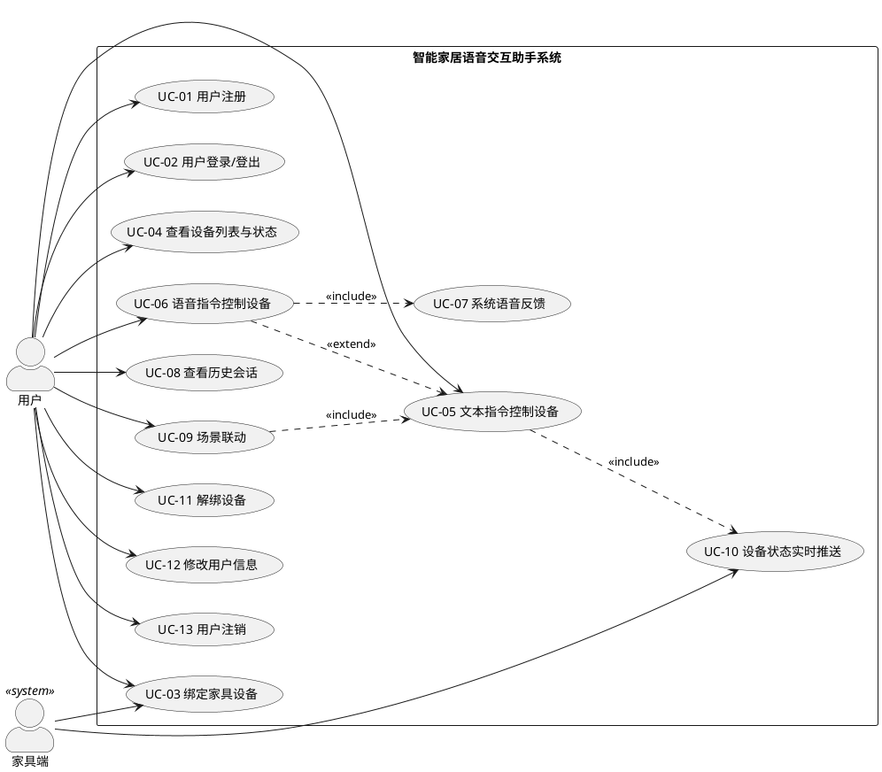
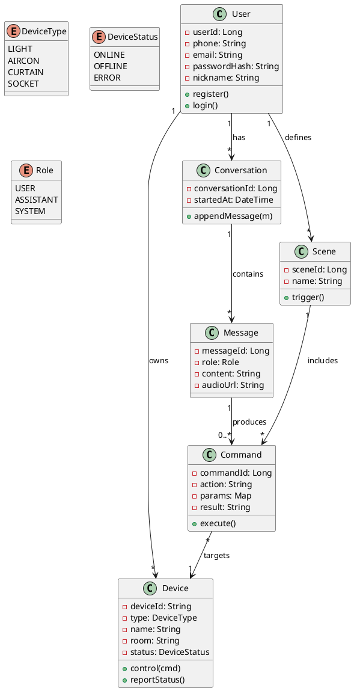
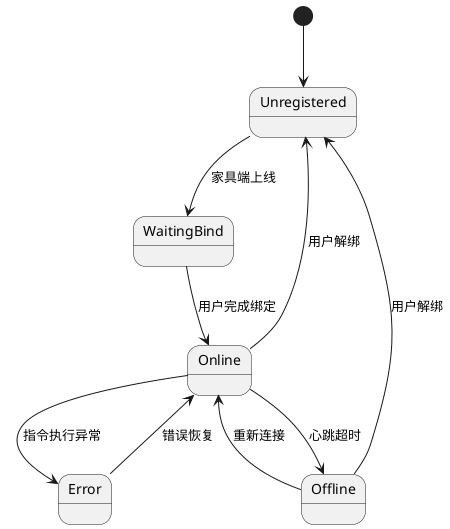
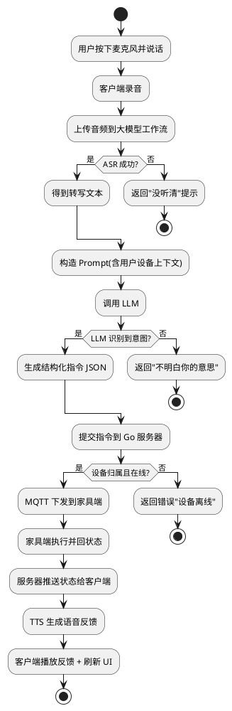
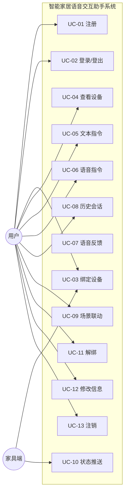

# 《智能家居语音交互助手系统》需求分析文档

| 项目名称 | 智能家居语音交互助手系统 |
|---|---|
| 项目代号 | SmartHome-Voice-Assistant（SHVA） |
| 文档版本 | v1.0 |
| 文档状态 | 草案（Draft） |
| 编写人 | 关梓浩 |
| 编写日期 | 2026-05-11 ~ 2026-05-17 |
| 审核人 | 全体成员 |

---

## 修订历史

| 版本 | 日期 | 修订人 | 修订内容 |
|---|---|---|---|
| v1.0 | 2026-05-17 | 关梓浩 | 初稿 |

---

## 1. 引言

### 1.1 编写目的

本文档面向项目全体成员、课程考核组及未来维护人员，清晰、完整、可验证地描述"智能家居语音交互助手系统（SHVA）"的功能需求与非功能需求，作为后续软件设计、编码实现与系统测试的基线。

### 1.2 项目背景

随着大语言模型（LLM）在语义理解与工具调用方面能力的成熟，"自然语言 + IoT"已成为全屋智能的核心交互方式。传统家居 App 要求用户在菜单中逐项点击，门槛高、效率低；本项目目标是让用户"说一句话"即可完成设备操作、场景联动与状态查询。

### 1.3 读者对象

- 课程考核组（评审）
- 项目队长（关梓浩）与开发成员
- 测试人员
- 后续维护/二次开发者

### 1.4 术语表

| 术语 | 说明 |
|---|---|
| 家具端 | 实际的家居设备或其模拟器，如灯、空调、窗帘 |
| 客户端 | Android App，用户交互入口 |
| 服务器 | Go 编写的后端服务，负责用户/设备管理与消息分发 |
| 大模型工作流 | Python 服务，负责编排**本地 ASR 服务**、**云端 LLM API**、**本地 TTS 服务** 三类 HTTP 接口，完成意图识别与指令生成 |
| 意图（Intent） | 用户指令经 LLM 抽取后的结构化动作，如 `turn_on(light, living_room)` |
| MQTT | Message Queuing Telemetry Transport，轻量级 IoT 消息协议 |

### 1.5 参考文档

- 《软件工程》课程实践考核要求说明.pdf
- 《软件工程实践选题说明》
- IEEE 830-1998 Recommended Practice for Software Requirements Specifications

---

## 2. 产品总体描述

### 2.1 产品定位

SHVA 是一套面向个人/家庭用户的"语音交互式"智能家居控制系统，覆盖**家具端 — 服务器 — 大模型 — 客户端**四层协同，以 Android App 作为用户入口，以大模型为"语义大脑"，以 Go 服务器为消息中枢，最终控制家具端设备。

### 2.2 系统组成

```
    ┌──────────────┐      语音/文本       ┌──────────────┐
    │  Android     │ ───────────────────▶ │  大模型工作流  │
    │  客户端       │ ◀─────── TTS ─────── │  (Python)    │
    └──────┬───────┘                      └──────┬───────┘
           │                                     │ 结构化指令
           │ 用户/会话/控制 API                    ▼
           │                              ┌──────────────┐
           └────────────────────────────▶ │  Go 服务器    │
                                          │  (消息中枢)    │
                                          └──────┬───────┘
                                                 │ MQTT/WS
                                                 ▼
                                          ┌──────────────┐
                                          │  家具端       │
                                          │  (设备/模拟)  │
                                          └──────────────┘
```

### 2.3 用户画像

| 用户类型 | 特征 | 核心诉求 |
|---|---|---|
| 普通家庭用户 | 非技术人员，习惯用语音 | 一句话控制设备，无需记指令 |
| 老人/儿童 | 不善操作 App | 语音优先，反馈清晰可听 |
| 技术爱好者 | 熟悉 IoT | 可自定义设备、查看日志 |

### 2.4 运行环境

| 端 | 环境 |
|---|---|
| Android 客户端 | Android 8.0 (API 26) 及以上 |
| 服务器 | Linux (Ubuntu 22.04) / Windows 10+；Go 1.21+ |
| 大模型工作流 | Python 3.10+；通过 HTTP 调用本地 ASR/TTS 服务与云端 LLM API |
| 本地 ASR 服务 | Python 3.10+ 或 C++（whisper.cpp）；FastAPI/Gin；CPU 可跑，GPU 更快；默认端口 9100 |
| 本地 TTS 服务 | Python 3.10+；FastAPI；默认端口 9200 |
| 家具端（模拟器） | 任意 Java/Go/Python 运行环境 |
| 家具端（真机，可选） | ESP32、树莓派等支持 MQTT 的硬件 |
| 数据库 | MySQL 8.0、Redis 7 |

### 2.5 假设与约束

1. 项目以"演示 + 教学"为目的，不考虑商用级高并发部署。
2. ASR 与 TTS 采用**本地独立部署的微服务**，对外提供 HTTP API，供大模型工作流调用；LLM 使用**第三方云端 API**（通义/豆包/DeepSeek 等），需稳定可用网络环境。
3. 家具端以"软件模拟器"作为默认实现，真实硬件为可选扩展。
4. 用户数量规模约为 **≤ 50 同时在线**，设备数 **≤ 200**。
5. 本地 ASR/TTS 模型文件较大（约 1~3 GB），需提前下载并纳入部署说明。

---

## 3. 功能需求

### 3.1 用例概览

系统共识别出 **1 个用户角色** + **1 个系统角色**，以及 **13 个核心用例**：

| 角色 | 描述 |
|---|---|
| 用户（User） | 已注册的终端用户，通过 Android 客户端使用系统 |
| 家具端（Device，系统角色） | 接入服务器、接收指令、上报状态 |

### 3.2 用例列表

| 编号 | 用例名称 | 优先级 | 主要角色 | 关联模块 |
|---|---|---|---|---|
| UC-01 | 用户注册 | Must | 用户 | 客户端、服务器 |
| UC-02 | 用户登录 / 登出 | Must | 用户 | 客户端、服务器 |
| UC-03 | 绑定家具设备 | Must | 用户 | 客户端、服务器、家具端 |
| UC-04 | 查看设备列表与状态 | Must | 用户 | 客户端、服务器 |
| UC-05 | 文本指令控制设备 | Must | 用户 | 客户端、大模型、服务器、家具端 |
| UC-06 | 语音指令控制设备 | Must | 用户 | 客户端、大模型、服务器、家具端 |
| UC-07 | 系统语音反馈 | Should | 用户 | 大模型、客户端 |
| UC-08 | 查看历史会话 | Should | 用户 | 客户端、服务器 |
| UC-09 | 场景联动（一键回家等） | Should | 用户 | 客户端、服务器、家具端 |
| UC-10 | 设备状态实时推送 | Must | 家具端 | 家具端、服务器、客户端 |
| UC-11 | 解绑设备 | Should | 用户 | 客户端、服务器 |
| UC-12 | 修改用户信息 / 密码 | Could | 用户 | 客户端、服务器 |
| UC-13 | 用户注销 | Could | 用户 | 客户端、服务器 |

> 说明：**至少 3 个关键用例（UC-02、UC-03、UC-05/UC-06）将在现场演示**，符合课程考核"实现用例不少于 3 个"的规模要求。

### 3.3 用例图

> 绘制工具：[draw.io](https://app.diagrams.net/) 或 PlantUML；导出 PNG 放入 `docs/images/usecase.png`。



### 3.4 详细用例规约

> 仅列出 3 个关键用例的完整规约，其余用例以"要点表"形式列出。完整版见 `docs/attachments/用例规约全集.md`。

#### UC-02 用户登录

| 项 | 内容 |
|---|---|
| **用例编号** | UC-02 |
| **用例名称** | 用户登录 |
| **优先级** | Must |
| **主要角色** | 用户 |
| **前置条件** | 用户已完成注册（UC-01） |
| **后置条件** | 客户端持有有效 JWT；服务器更新用户在线状态 |
| **主成功场景** | 1. 用户打开 App，进入登录页<br>2. 输入手机号/邮箱 + 密码<br>3. 点击"登录"<br>4. 客户端提交凭证到服务器<br>5. 服务器校验通过，签发 JWT<br>6. 客户端保存 Token，跳转主页 |
| **扩展场景** | **5a. 校验失败**：服务器返回 401，客户端提示"账号或密码错误"<br>**4a. 网络异常**：客户端提示"网络不可用，请稍后重试"<br>**2a. 输入为空**：客户端本地校验，高亮输入框并提示 |
| **特殊需求** | 连续 5 次登录失败需锁定账号 10 分钟 |
| **频率** | 每人每日 ≥ 1 次 |

#### UC-03 绑定家具设备

| 项 | 内容 |
|---|---|
| **用例编号** | UC-03 |
| **用例名称** | 绑定家具设备 |
| **优先级** | Must |
| **主要角色** | 用户；协作：家具端 |
| **前置条件** | 用户已登录；家具端已上电并连接服务器，处于"待绑定"状态 |
| **后置条件** | 设备信息写入数据库并归属该用户 |
| **主成功场景** | 1. 用户在客户端点击"添加设备"<br>2. 客户端发起扫描请求<br>3. 服务器返回当前在线且未绑定的设备列表<br>4. 用户从列表中选中目标设备并输入自定义名称、所在房间<br>5. 客户端提交绑定请求<br>6. 服务器校验并写入 `device` 表，向家具端下发"已绑定"消息<br>7. 客户端提示绑定成功 |
| **扩展场景** | **3a. 无设备可选**：提示"请确认家具端是否上电并联网"<br>**6a. 设备已被他人绑定**：服务器返回 409 冲突 |
| **特殊需求** | 每位用户最多绑定 20 台设备 |

#### UC-06 语音指令控制设备

| 项 | 内容 |
|---|---|
| **用例编号** | UC-06 |
| **用例名称** | 语音指令控制设备 |
| **优先级** | Must |
| **主要角色** | 用户；协作：大模型工作流、服务器、家具端 |
| **前置条件** | 用户已登录；至少绑定了一台设备 |
| **后置条件** | 目标设备状态变更；会话被记录；可选 TTS 语音反馈 |
| **主成功场景** | 1. 用户长按客户端麦克风按钮说话<br>2. 客户端录音（≤ 15 秒），松开按钮后将音频文件上传至大模型工作流<br>3. 大模型工作流调用 ASR 将音频转为文本<br>4. 大模型工作流将文本 + 用户设备上下文发送给 LLM，得到结构化指令（JSON）<br>5. 大模型工作流将指令提交至服务器<br>6. 服务器校验设备归属与合法性，通过 MQTT 将控制指令下发至家具端<br>7. 家具端执行指令并回传新状态<br>8. 服务器把新状态推送给客户端<br>9. 大模型工作流生成自然语言应答文本并（可选）合成 TTS 返回<br>10. 客户端显示会话文本、播放语音、刷新设备状态 |
| **扩展场景** | **3a. ASR 失败**：返回 "抱歉我没听清"，客户端提示用户重说<br>**4a. LLM 识别不到意图**：返回"不太明白你的意思"<br>**6a. 设备离线**：返回错误"客厅灯当前离线，无法控制"<br>**2a. 录音时长 > 15s**：客户端自动停止并提示 |
| **特殊需求** | 端到端（录音结束 → 首条响应）响应时间 ≤ 3 秒（非功能需求 NFR-P1） |
| **频率** | 演示中每分钟可能 2~3 次 |

#### 其余用例要点表

| 用例 | 输入 | 关键业务规则 | 主要异常 |
|---|---|---|---|
| UC-01 用户注册 | 手机号/邮箱、密码、昵称 | 密码至少 8 位，含字母与数字；手机号/邮箱唯一 | 已存在、格式错误 |
| UC-04 查看设备列表 | — | 仅返回本人设备；区分在线/离线 | 无设备提示空状态 |
| UC-05 文本指令 | 文本消息 | 与 UC-06 共用大模型工作流，跳过 ASR | 同 UC-06 的 4a/6a |
| UC-07 语音反馈 | 文本 | TTS 失败时降级为文本 | API 限流 |
| UC-08 查看历史会话 | 分页参数 | 按 `conversation_id` 分组，倒序 | 无记录返回空列表 |
| UC-09 场景联动 | 场景名称 | 场景=多条指令序列，支持并发下发 | 任一设备失败不阻塞其他 |
| UC-10 状态实时推送 | 家具端上报 | 服务器用 WebSocket 推送给对应用户 | 用户离线则缓存最新状态 |
| UC-11 解绑设备 | 设备 ID | 仅 owner 可解绑；解绑后通知家具端 | 设备不存在 |
| UC-12 修改用户信息 | 昵称、头像、密码 | 密码修改需验证旧密码 | 旧密码错误 |
| UC-13 用户注销 | 密码确认 | 软删除；设备批量解绑 | 密码错误 |

---

## 4. 非功能需求

### 4.1 性能需求（NFR-P）

| 编号 | 需求 | 指标 |
|---|---|---|
| NFR-P1 | 语音指令端到端响应时间 | ≤ 3 秒（P90） |
| NFR-P2 | 文本指令端到端响应时间 | ≤ 1.5 秒（P90） |
| NFR-P3 | 服务器并发能力 | ≥ 50 在线用户，200 台设备同时推送 |
| NFR-P4 | 客户端启动时间 | ≤ 2 秒（冷启动） |
| NFR-P5 | 状态推送延迟 | 家具端上报 → 客户端显示 ≤ 1 秒 |

### 4.2 可靠性需求（NFR-R）

| 编号 | 需求 | 指标 |
|---|---|---|
| NFR-R1 | 服务可用性 | 演示期间服务器可用率 ≥ 99% |
| NFR-R2 | 故障恢复 | 服务器进程崩溃后 `systemd/supervisor` 自动拉起 ≤ 30s |
| NFR-R3 | 消息不丢失 | MQTT 使用 QoS1；数据库事务保证一致性 |
| NFR-R4 | 家具端断线 | 客户端明显展示"离线"标识，避免误操作 |

### 4.3 安全性需求（NFR-S）

| 编号 | 需求 | 说明 |
|---|---|---|
| NFR-S1 | 通信加密 | 客户端 ↔ 服务器使用 HTTPS / WSS；MQTT 使用 TLS（演示允许降级为明文但需说明） |
| NFR-S2 | 身份认证 | JWT + Refresh Token；Token 有效期 2 小时 |
| NFR-S3 | 权限校验 | 所有设备相关接口校验"设备归属用户" |
| NFR-S4 | 密码存储 | bcrypt 加盐哈希，禁止明文存储 |
| NFR-S5 | 敏感信息 | 不在日志中打印密码、完整 Token、用户手机号 |
| NFR-S6 | 注入攻击防护 | ORM 参数化查询；前端对输入做基本过滤（SQL 注入、XSS） |
| NFR-S7 | 限流 | 登录接口 10 次/分钟/IP；LLM 调用按用户配额 |

### 4.4 易用性需求（NFR-U）

| 编号 | 需求 |
|---|---|
| NFR-U1 | 主要操作均可在 3 步以内完成 |
| NFR-U2 | 关键按钮（语音、控制）在主页"一眼可见" |
| NFR-U3 | 异常提示用白话描述，不暴露技术术语（如 "500 Internal Error"） |
| NFR-U4 | 支持深色模式 |

### 4.5 兼容性需求（NFR-C）

| 编号 | 需求 |
|---|---|
| NFR-C1 | 客户端兼容 Android 8.0 ~ Android 14，典型机型 Pixel、小米、华为、OPPO 各覆盖 1 款 |
| NFR-C2 | 服务器兼容 Linux 与 Windows 开发机，提供 Docker Compose 一键启动 |
| NFR-C3 | 家具端协议兼容 MQTT v3.1.1 和 WebSocket，两种方式任选 |

### 4.6 可维护性需求（NFR-M）

| 编号 | 需求 |
|---|---|
| NFR-M1 | 代码遵循统一风格指南（Go: gofmt + golangci-lint；Kotlin: ktlint；Python: ruff+black） |
| NFR-M2 | 每个服务独立可部署；配置通过 `.env` 管理 |
| NFR-M3 | 关键路径日志覆盖率 100%，使用结构化日志（JSON） |
| NFR-M4 | 核心模块单元测试覆盖率 ≥ 60% |

### 4.7 可扩展性需求（NFR-E）

| 编号 | 需求 |
|---|---|
| NFR-E1 | LLM 提供商可替换（抽象 `LLMProvider` 接口） |
| NFR-E2 | 设备类型可扩展（新增设备类型无需修改核心调度逻辑） |
| NFR-E3 | 前端可替换为 iOS / Web 而无需变更服务器 |

---

## 5. 数据需求

### 5.1 主要数据实体

| 实体 | 说明 | 关键属性 |
|---|---|---|
| User | 终端用户 | user_id, phone, email, password_hash, nickname, created_at |
| Device | 家具设备 | device_id, owner_id, device_type, name, room, status, last_online_at |
| Conversation | 一次对话会话 | conversation_id, user_id, started_at |
| Message | 对话消息（用户或系统） | message_id, conversation_id, role, content, audio_url, created_at |
| Command | LLM 产生的结构化指令 | command_id, message_id, device_id, action, params, result |
| Scene | 场景（多指令集合） | scene_id, user_id, name, command_list |

详见《软件设计文档》的 ER 图与表结构。

### 5.2 数据量估算

| 实体 | 日增量（演示期） | 总规模（两个月） |
|---|---|---|
| User | 6 ~ 20 | ≤ 100 |
| Device | 5 ~ 30 | ≤ 200 |
| Message | 200 ~ 500 | ≤ 30,000 |
| Command | 100 ~ 300 | ≤ 20,000 |

---

## 6. 外部接口需求

### 6.1 用户接口（UI）

- Android 客户端：主要页面包括**登录/注册页、主页（设备列表）、控制面板、对话页、设备绑定页、个人中心**。UI 细节见《软件设计文档》与 Figma 原型。

### 6.2 硬件接口

- 家具端（模拟器）：无特殊硬件依赖。
- 家具端（硬件）：ESP32/树莓派；通过 WiFi 接入；对外以 MQTT over TCP 通信。

### 6.3 软件接口

| 接口 | 说明 |
|---|---|
| 第三方 LLM API | 通义千问 / 豆包 / DeepSeek 任选其一为主用，其他为备用（仅 LLM 推理走云端） |
| 本地 ASR 服务 API | 由本地 `asr-server` 独立进程/容器提供 HTTP 接口，底层引擎可选 FunASR / whisper.cpp |
| 本地 TTS 服务 API | 由本地 `tts-server` 独立进程/容器提供 HTTP 接口，底层引擎可选 Edge-TTS / Piper / VITS |
| MQTT Broker | EMQX 5 或 Mosquitto 2，默认端口 1883（加密 8883） |
| MySQL | JDBC / GORM 连接；字符集 utf8mb4 |
| Redis | 缓存 Token、设备在线表 |

### 6.4 通信接口

| 通道 | 协议 | 用途 |
|---|---|---|
| 客户端 ↔ 服务器（REST） | HTTPS/JSON | 登录、设备管理等同步请求 |
| 客户端 ↔ 服务器（WebSocket） | WSS | 实时状态推送、会话流 |
| 客户端 ↔ 大模型工作流 | HTTPS/multipart | 上传音频、文本输入 |
| 大模型工作流 ↔ 服务器 | HTTPS/JSON | 提交结构化指令 |
| 服务器 ↔ 家具端 | MQTT v3.1.1 | 指令下发、状态上报 |

---

## 7. 领域模型与分析类图

### 7.1 领域模型（Domain Model）



### 7.2 关键状态图：设备状态（Device）



### 7.3 关键活动图：语音指令处理（UC-06）



---

## 8. 需求优先级与 MoSCoW 矩阵

| 优先级 | 说明 | 用例编号 |
|---|---|---|
| **Must Have**（必做，决定演示成败） | UC-01, UC-02, UC-03, UC-04, UC-05, UC-06, UC-10 |
| **Should Have**（应做，影响体验） | UC-07, UC-08, UC-09, UC-11 |
| **Could Have**（锦上添花） | UC-12, UC-13 |
| **Won't Have (this time)** | 多用户共享设备、家庭成员管理、AI 对话式场景生成、跨品牌真实设备接入、iOS 客户端 |

---

## 9. 需求跟踪矩阵（摘要）

> 用例 → 设计模块 → 测试用例 的可追溯关系。完整版在交付前由关梓浩统一维护在 `docs/attachments/RTM.xlsx`。

| 需求编号 | 用例 | 设计文档对应模块 | 测试用例 ID |
|---|---|---|---|
| FR-01 | UC-01 用户注册 | `auth.Register` | TC-AUTH-01 ~ TC-AUTH-05 |
| FR-02 | UC-02 用户登录 | `auth.Login` | TC-AUTH-06 ~ TC-AUTH-10 |
| FR-03 | UC-03 绑定设备 | `device.Bind` | TC-DEV-01 ~ TC-DEV-05 |
| FR-05 | UC-05 文本指令 | `chat.Text` + `llm.Infer` | TC-CHAT-01 ~ TC-CHAT-06 |
| FR-06 | UC-06 语音指令 | `chat.Voice` + `llm.Infer` + `asr` + `tts` | TC-CHAT-07 ~ TC-CHAT-15 |
| FR-10 | UC-10 状态推送 | `device.WSPush` + `mqtt.Subscriber` | TC-DEV-10 ~ TC-DEV-14 |
| NFR-P1 | 语音响应 ≤3s | 全链路 | TC-PERF-01 |
| NFR-S2 | JWT 认证 | `auth.Middleware` | TC-SEC-01 ~ TC-SEC-03 |

---

## 10. 验收标准

本需求分析文档通过验收的标志：

1. ✅ 所有 **Must Have** 用例在代码中实现并通过对应测试用例。
2. ✅ 所有 **非功能需求** 在测试报告中提供验证证据（日志、截图或测试脚本）。
3. ✅ 用例图、活动图、状态图、领域模型图绘制完毕，源文件与 PNG 同步入库。
4. ✅ 全体成员对本文档签字（可在 Git PR 中 approve 代替）。
5. ✅ 课程考核组评分 ≥ 16 分（"准确全面"档次）。

---

## 附录 A：Mermaid 版需求用例视图（可直接在 Markdown 预览）


