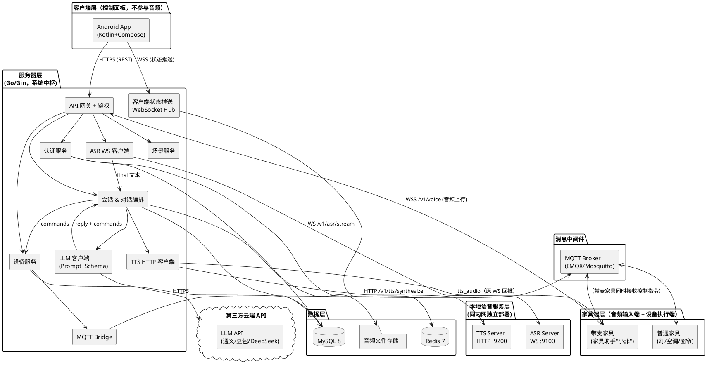
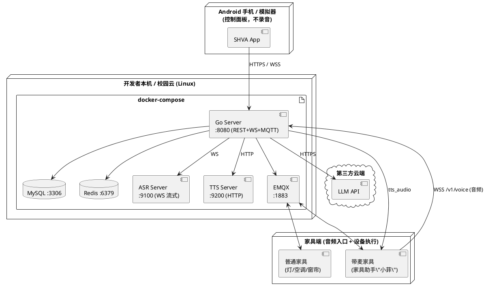
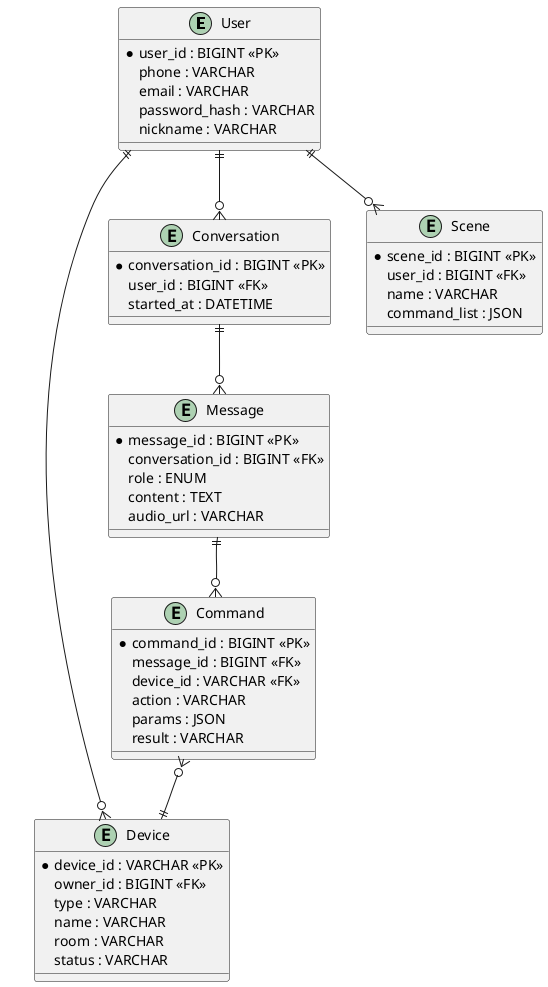
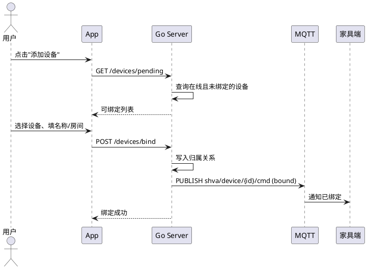
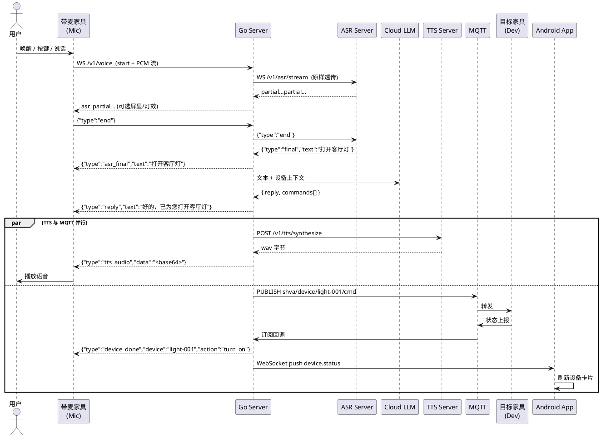
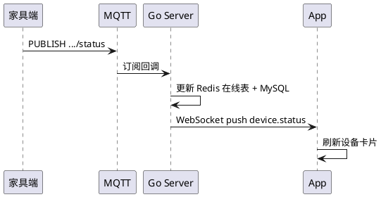

# 《智能家居语音交互助手系统》软件设计文档

| 项目名称 | 智能家居语音交互助手系统 |
|---|---|
| 项目代号 | SmartHome-Voice-Assistant（SHVA） |
| 文档版本 | v1.0 |
| 文档状态 | 草案（Draft） |
| 编写人 | 关梓浩（统稿）；林帅 / 马正朗 / 吴承凯 / 刘智冲（分模块） |
| 编写日期 | 2026-05-18 ~ 2026-05-24 |
| 审核人 | 全体成员 |

---

## 修订历史

| 版本 | 日期 | 修订人 | 修订内容 |
|---|---|---|---|
| v1.0 | 2026-05-24 | 关梓浩 | 初稿 |
| v1.1 | 2026-05-09 | 关梓浩 | 架构调整：音频输入源由 App 改为家具端；原 M-LM（Python 工作流）合并进 Go Server；新增 Go Server ↔ ASR 的 WebSocket 流式链路；客户端不再承担录音职责 |

---

## 1. 引言

### 1.1 编写目的

本文档描述"智能家居语音交互助手系统（SHVA）"的总体架构与关键设计决策，包括模块划分、接口约定、数据组织、关键流程等，作为后续编码实现与测试的依据。**本文聚焦"做什么、怎么分、怎么接"，不涉及具体实现代码与目录结构，相关细节由各模块在开发阶段自行决定。**

### 1.2 设计原则

| 原则 | 说明 |
|---|---|
| 分层架构 | 表现层 / 业务逻辑层 / 数据层 清晰分离 |
| 高内聚低耦合 | 按业务领域划分模块，模块间仅通过接口通信 |
| 面向接口编程 | ASR、TTS、LLM、设备协议均以接口或 API 形式暴露，底层实现可替换 |
| 消息驱动 | 设备侧采用 MQTT 发布/订阅，避免强耦合 |
| 面向演示 | 关键链路优先保证稳定与可视化，避免过度设计 |

---

## 2. 总体架构

### 2.1 系统总体架构图



**架构要点（v1.1 调整）**：

1. **音频输入端是家具端，不是 App**：用户对着"带麦家具"（家具助手"小菲"）说话，家具端通过 WebSocket 把 PCM 流发给 Go Server。
2. **Go Server 是系统中枢**：承担原 Python LLM Worker 的全部职责（ASR/LLM/TTS 编排），客户端 / 家具端均只与 Go Server 对接。
3. **客户端 App 不录音**：仅做登录、设备管理、状态查看、场景触发、对话历史，通过 REST + WSS 与 Go Server 通信。
4. **ASR 走 WebSocket 流式**：`ws://asr:9100/v1/asr/stream`，Go Server 在 `/v1/voice` 端点对家具端音频做透明转发。

### 2.2 分层结构

| 层 | 职责 | 实现 |
|---|---|---|
| 表现层（控制） | 用户交互、设备状态展示、场景操作 | Android App（不录音） |
| 表现层（音频） | 麦克风录音、音频上行、TTS 回播、设备执行 | 家具端（带麦音箱 / 灯 / 空调等） |
| 业务逻辑层 | 认证、设备管理、对话编排（ASR/LLM/TTS 串联）、场景 | Go 服务器（**系统中枢**） |
| 智能服务层 | 本地流式 ASR、本地 TTS、云端 LLM | FunASR + Piper + 云端 API |
| 数据层 | 持久化与缓存 | MySQL / Redis / 文件存储 |
| 消息层 | 设备接入与指令分发 | MQTT Broker |

### 2.3 模块划分

| 模块 | 所属端 | 核心职责 | 负责人 |
|---|---|---|---|
| M-CL Android 客户端 | 客户端 | 登录 / 设备管理 / 状态展示 / 场景 / 对话历史（**不录音**） | 马正朗 |
| M-DE 家具端 | 家具端 | 录音（带麦家具）→ WS 上行；设备驱动 / 模拟；MQTT 通信 | 刘智冲 |
| M-GW API 网关 | 服务器 | 客户端 REST / 家具端 WS 接入、鉴权、限流、日志 | 林帅 |
| M-AU 认证服务 | 服务器 | 用户注册、登录、JWT 签发/校验；设备 Token 校验 | 关梓浩 + 林帅 |
| M-DV 设备服务 | 服务器 | 设备绑定、状态缓存、MQTT 收发 | 林帅 |
| M-CH 会话 & 对话编排 | 服务器 | **核心**：家具端音频 WS 透传到 ASR、调云端 LLM、MQTT 派发、调 TTS；会话持久化、客户端状态推送 | 林帅 + 吴承凯 |
| M-SC 场景服务 | 服务器 | 场景定义与触发 | 林帅 |
| M-AS 本地 ASR 服务 | 语音服务 | **WebSocket 流式**识别（主）+ HTTP 整段识别（调试） | 吴承凯 |
| M-TS 本地 TTS 服务 | 语音服务 | HTTP 语音合成 | 吴承凯 |

> **v1.1 变更**：原 `M-LM 大模型工作流（Python/FastAPI）` 模块**取消**，其职责（ASR 编排、云端 LLM 调用、TTS 编排、结构化指令生成）合并进 Go Server 的 `M-CH` 模块。原 Python 工作流层不再存在；ASR / TTS 仍保留为独立本地服务（M-AS / M-TS），由 Go Server 直接调用。

### 2.4 部署视图



---

## 3. 关键模块设计

> 本节只描述每个模块的**职责、核心类/组件、对外契约**，具体实现（文件目录、代码细节、算法）由开发阶段根据约定自由落地。

### 3.1 Go 服务器（M-GW / M-AU / M-DV / M-CH / M-SC）

**职责**：系统中枢。对客户端提供 REST + WebSocket；对家具端提供音频 WebSocket（`/v1/voice`）与 MQTT 控制通道；内部完成 ASR / 云端 LLM / TTS 的编排。

**核心组件**：

| 组件 | 职责 |
|---|---|
| API Gateway | 路由分发、JWT / 设备 Token 鉴权、限流、统一错误包装 |
| 认证服务 | 用户密码校验、Token 签发/刷新；设备 Token 校验 |
| 设备服务 | 绑定/解绑、归属校验、通过 MQTT 下发指令、接收设备状态 |
| 会话 & 对话编排 | `/v1/voice` 家具端音频 WS 透传到 ASR；拿到 final 文本后调云端 LLM；解析 JSON 指令；MQTT 派发；调 TTS 回播；会话/消息持久化 |
| 客户端状态推送 | `/ws` WebSocket Hub，推送 device.status / chat.message 给 App |
| 场景服务 | 组合多条指令、触发场景 |
| LLM 客户端 | Prompt 模板、JSON Schema 校验、多 Provider 切换（通义/豆包/DeepSeek） |
| ASR 客户端 | 与本地 ASR 建立 WebSocket 流式连接，透明转发家具端音频字节 |
| TTS 客户端 | HTTP 调用本地 TTS，取 wav 字节后 base64 推回家具端 |

**服务间依赖**：所有业务服务依赖认证服务做鉴权；设备服务独占 MQTT Bridge；对话编排独占 ASR/TTS/LLM 客户端；客户端推送独占 WebSocket Hub。

### 3.2 Android 客户端（M-CL）

**职责**：作为用户的**控制与管理面板**，承担登录、设备管理、状态展示、场景操作、对话历史查看。**不录音、不承担音频链路**——音频输入由家具端完成。

**主要界面与交互**：

| 页面 | 关键元素 |
|---|---|
| 登录 / 注册 | 手机号/邮箱 + 密码 |
| 主页（设备） | 设备卡片列表；在线状态；家具端在线指示 |
| 设备详情 | 开关、亮度/温度/位置 等控件 |
| 绑定设备 | 可绑定设备列表、命名、选房间 |
| 对话历史 | 浏览家具端语音交互产生的对话记录（跨端同步） |
| 场景页 | 场景卡片、一键触发 |
| 个人中心 | 资料、改密码、登出 |

**技术选型**：Kotlin + Jetpack Compose（Material 3）；Retrofit + OkHttp（REST + WebSocket）；MVVM 架构。**不需要** `MediaRecorder / AudioRecord`。

### 3.3 本地语音服务（M-AS / M-TS）

**职责**：为 Go Server 提供本地低延迟的 ASR / TTS 能力；LLM 由 Go Server 直接调云端 API，不再经本模块。

| 子模块 | 部署 | 对外协议 | 职责 |
|---|---|---|---|
| M-AS 本地 ASR 服务 | 本地（独立进程/容器） | **WebSocket `/v1/asr/stream`（主）** + HTTP `/v1/asr/transcribe`（调试） | 流式语音识别（FunASR paraformer-zh-streaming + fsmn-vad） |
| M-TS 本地 TTS 服务 | 本地（独立进程/容器） | HTTP `/v1/tts/synthesize` | 语音合成（Piper huayan-medium） |
| 云端 LLM API | 云端 | HTTPS | 接收文本+设备上下文，输出结构化 JSON 指令（由 Go Server 直接调用） |

**关键契约（LLM 输出 JSON Schema）**：云端 LLM 的输出必须严格遵守如下结构：

```json
{
  "intent": "control_device | query_status | trigger_scene | chit_chat | unknown",
  "reply": "自然语言应答",
  "commands": [
    { "device_id": "xxx", "action": "turn_on", "params": { } }
  ]
}
```

**支持的设备动作**：

| 设备类型 | 动作 | 参数 |
|---|---|---|
| LIGHT | `turn_on / turn_off / set_brightness` | `brightness: 0~100` |
| AIRCON | `turn_on / turn_off / set_temp / set_mode` | `temp: 16~30`、`mode: cool/heat/auto` |
| CURTAIN | `open / close / set_position` | `position: 0~100` |
| SOCKET | `turn_on / turn_off` | — |

**降级策略**：云端 LLM 不可用时切备用 Provider；ASR 服务不可达时家具端降级为"等一下再试"的 TTS 提示；TTS 不可达时 Go Server 只回 `reply` 文本帧，家具端本地 TTS 兜底或跳过语音播报。

### 3.4 家具端（M-DE）

**职责**：本系统的音频输入端 + 设备执行端。

| 子类 | 典型设备 | 通道 | 职责 |
|---|---|---|---|
| 带麦家具 | 家具助手"小菲"（智能音箱形态）、网关 | WS `/v1/voice` + MQTT | 麦克风录音 → 16k/16-bit/mono PCM → WS 上传；接收 `asr_partial / asr_final / reply / tts_audio`；播放 TTS；同时受 MQTT 控制 |
| 普通家具 | 灯、空调、窗帘、插座 | 仅 MQTT | 接收控制指令；上报状态与心跳 |

**实现策略**：**软件模拟器优先、硬件为辅**。带麦家具可先用 PC + 麦克风跑 Python WS 客户端模拟；普通家具用软件模拟器遵循同一 MQTT 协议（见 4.4）。若 ESP32 / 树莓派 硬件调通可加分。

**家具端详细协议**：见 [`furniture/README.md`](../furniture/README.md)。

---

## 4. 接口设计

### 4.1 接口全景

| 通道 | 协议 | 调用方 → 被调方 | 用途 |
|---|---|---|---|
| 客户端 API | HTTPS / JSON | Android App → Go 服务器 | 登录、设备管理、场景、对话历史 |
| 客户端状态推送 | WSS | Go 服务器 → Android App | 设备状态、新消息推送 |
| **家具端音频** | **WSS** | **带麦家具 → Go 服务器** | **音频上行 / 识别文本与回复下行 / TTS 回播** |
| ASR 流式 | WS / 二进制+JSON | Go 服务器 → ASR Server | 流式语音识别（**主路径**） |
| ASR 兼容 | HTTP / multipart | Go 服务器 → ASR Server | 整段识别（调试 / 冒烟） |
| TTS 服务 | HTTP / JSON | Go 服务器 → TTS Server | 语音合成 |
| LLM 调用 | HTTPS / JSON | Go 服务器 → 云端 LLM | 意图识别、生成结构化指令 |
| 设备通信 | MQTT v3.1.1 | Go 服务器 ↔ 家具端 | 指令下发、状态上报 |

### 4.2 客户端 REST API（Go 服务器）

Base URL：`https://<host>/api/v1`；除登录注册外均需 `Authorization: Bearer <jwt>`。统一响应包装：`{ code, msg, data }`。

**主要接口分组**：

| 模块 | 端点 | 对应用例 |
|---|---|---|
| 认证 | `POST /auth/register`、`POST /auth/login`、`POST /auth/logout` | UC-01、UC-02 |
| 用户 | `GET / PATCH /users/me`、`POST /users/me/password`、`DELETE /users/me` | UC-12、UC-13 |
| 设备 | `GET /devices`、`GET /devices/pending`、`POST /devices/bind`、`POST /devices/{id}/unbind`、`GET /devices/{id}/status` | UC-03、UC-04、UC-11 |
| 会话 | `GET /conversations`、`GET /conversations/{id}/messages` | UC-08 |
| 场景 | `GET /scenes`、`POST /scenes`、`POST /scenes/{id}/trigger` | UC-09 |

> 注：v1.0 列出的 `POST /commands`（Python 工作流回传指令）已取消，因对话编排合并进 Go Server 内部。

完整参数与示例在开发阶段由林帅 维护于 `docs/attachments/openapi.yaml`。

### 4.3 WebSocket 事件

- 连接地址：`wss://<host>/ws?token=<jwt>`
- 客户端每 30s `ping`；服务端 `pong`

| `type` | Payload（关键字段） | 触发时机 |
|---|---|---|
| `device.status` | `device_id, status, detail` | 家具端状态变更 |
| `device.online` / `device.offline` | `device_id` | 设备上/下线 |
| `chat.message` | `message_id, role, content, audio_url` | 新消息入库（跨端同步） |

### 4.4 MQTT Topic 规范

| Topic | 方向 | 说明 | QoS |
|---|---|---|---|
| `shva/device/{id}/register` | Dev→Server | 上线注册 | 1 |
| `shva/device/{id}/cmd` | Server→Dev | 下发控制指令 | 1 |
| `shva/device/{id}/status` | Dev→Server | 状态上报 | 1 |
| `shva/device/{id}/result` | Dev→Server | 指令执行结果 | 1 |
| `shva/device/{id}/heartbeat` | Dev→Server | 心跳（30s） | 0 |

### 4.5 家具端音频 WebSocket（Go 服务器 ↔ 带麦家具）

- 连接地址：`wss://<host>/v1/voice?device_id=<id>&token=<device-token>`
- 录音强约束：**16 kHz / 16-bit signed LE PCM / 单声道**；建议每 ~600 ms 发一包（19200 字节）

| 方向 | 帧类型 | 内容 |
|---|---|---|
| 家具→Server | text | `{"type":"start","sample_rate":16000,"format":"pcm_s16le","channels":1}` |
| 家具→Server | binary | 16-bit LE PCM mono 字节流 |
| 家具→Server | text | `{"type":"end"}` / `{"type":"ping"}` |
| Server→家具 | text | `{"type":"asr_partial","text":"..."}` |
| Server→家具 | text | `{"type":"asr_final","text":"..."}` |
| Server→家具 | text | `{"type":"reply","text":"..."}` |
| Server→家具 | text | `{"type":"device_done","device":"...","action":"..."}` |
| Server→家具 | text | `{"type":"tts_audio","format":"wav","data":"<base64>"}` |
| Server→家具 | text | `{"type":"error","message":"..."}` / `{"type":"pong"}` |

完整协议与时序图见 [`furniture/README.md`](../furniture/README.md) 与 [`server/README.md`](../server/README.md)。

### 4.6 本地 ASR / TTS 服务接口

| 接口 | 类型 | 输入 | 输出 |
|---|---|---|---|
| `WS /v1/asr/stream` | WebSocket 流式（**主**） | 首帧 start + 二进制 PCM 流 + end | `ready / partial / final / eos / error` JSON 帧 |
| `POST /v1/asr/transcribe` | HTTP 整段（调试） | 音频文件（multipart） | `{ text, duration_ms }` |
| `POST /v1/tts/synthesize` | HTTP | `{ text, voice, format }` | 音频字节流 `audio/wav` |
| `GET /v1/health` | HTTP | — | 服务状态 |

> 流式 ASR 的帧协议与家具端 ↔ Go Server 完全同构（Go Server 只改写事件类型前缀，不动字节内容）。

### 4.7 错误码约定（节选）

| code | 说明 |
|---|---|
| 0 | 成功 |
| 4001 | 参数错误 |
| 4010 / 4011 | 未登录 / Token 过期 |
| 4030 | 无权限（设备不属于当前用户） |
| 4040 | 资源不存在 |
| 4090 | 设备已被绑定 |
| 4291 | 请求过于频繁 |
| 5000 | 服务器内部错误 |
| 5001 | 大模型服务不可用 |
| 5002 | 设备离线 |

---

## 5. 数据库设计

### 5.1 ER 图



### 5.2 表与缓存职责

| 存储 | 数据 | 说明 |
|---|---|---|
| MySQL `user` | 用户基本信息 | 密码 bcrypt 存储 |
| MySQL `device` | 设备归属与元信息 | `owner_id` 建索引 |
| MySQL `conversation / message` | 会话与消息记录 | 按会话+时间复合索引 |
| MySQL `command` | 指令执行记录 | 便于审计与回放 |
| MySQL `scene` | 场景定义 | `command_list` 以 JSON 存储 |
| Redis | Token、在线用户集、设备在线心跳、接口限流 | 具体 Key 设计在开发时由林帅 维护 |

> 完整字段、类型、索引、默认值在开发阶段由林帅 以 Migration SQL 脚本落地（`migrations/` 目录），本文不再列出详细 DDL。

---

## 6. 关键流程设计

> 选取 3 条最能体现系统协作的核心链路作为代表，其余流程（注册、解绑、历史查询等）在实现时按同一思路拆分。

### 6.1 设备绑定（UC-03）



### 6.2 语音指令全链路（UC-06，系统核心链路）



### 6.3 设备状态实时推送（UC-10）



---

## 7. 界面设计

### 7.1 设计规范

- 设计系统：Material 3
- 主色 `#4A90E2`（智慧蓝）；辅色 `#27AE60`（成功）、`#E74C3C`（警告）
- 卡片圆角 16 dp、按钮圆角 12 dp；支持暗色模式

### 7.2 页面清单

见 3.2 节。详细线框图与交互稿由容嘉 使用 Figma 维护，最终导出 PNG 放入 `docs/images/ui/`。

---

## 8. 安全与非功能需求落地

| NFR | 落地方案 |
|---|---|
| NFR-P1 语音 ≤3s | **流式 ASR**（边说边转，中间结果延迟 400~800ms）；Go Server 拿到 final 立即调 LLM；TTS 与 MQTT 并行；家具端与服务同内网 |
| NFR-P5 状态推送 ≤1s | MQTT + WebSocket 内存路由，不落库 |
| NFR-R2 自动拉起 | `systemd` 或 Docker `restart: always` |
| NFR-R3 消息不丢 | MQTT QoS 1 + 数据库事务 |
| NFR-S1 传输与隐私 | HTTPS / WSS；原始音频仅在本地内网流转（家具端 → Go Server → ASR），仅文本进入云端 LLM |
| NFR-S2 认证 | 用户 JWT（HS256，2h 过期）+ Refresh Token；家具端长期 device token |
| NFR-S4 密码存储 | bcrypt 加盐哈希 |
| NFR-E1 可替换 | LLM Provider 与 ASR/TTS 服务均以接口/HTTP/WS 形式暴露，可热切换 |

---

## 9. 技术选型决策记录（ADR）

| 编号 | 主题 | 决策 | 理由 |
|---|---|---|---|
| ADR-01 | 服务器语言 | Go | 队内掌握、并发性能好、单二进制部署 |
| ADR-02 | 客户端平台 | Android | 主流、工具链成熟、马正朗 熟悉 |
| ADR-03 | 语音与 LLM 部署 | ASR/TTS 本地独立服务（ASR 走 WebSocket 流式），LLM 云端 API 由 Go Server 直接调用 | 本地 ASR/TTS 延迟低、隐私可控；云端 LLM 能力强；流式 ASR 进一步压低交互延迟 |
| ADR-04 | 设备协议 | MQTT | IoT 事实标准、天然发布订阅 |
| ADR-05 | 家具端实现 | 软件模拟器优先（含带麦家具 Python 模拟器） | 硬件风险高，先保证可演示 |
| ADR-06 | 文档协作 | Markdown → Pandoc 导出 Word | 便于多人并行编写、Git 管理 |
| ADR-07 | 音频输入源 | 家具端（带麦音箱），非手机 App | 场景更贴近智能家居实际使用；App 只做控制面板，降低客户端复杂度 |
| ADR-08 | LLM 编排位置 | 由 Go Server 直接承担，不再单设 Python 工作流模块 | 减少一跳网络 / 一个部署单元；Go 对 JSON Schema 解析与多 Provider 切换能力足够 |

---

## 10. 遗留问题与后续计划

| 编号 | 问题 | 处理计划 |
|---|---|---|
| OPEN-01 | 家具端具体硬件尚未确定（ESP32 / 树莓派 / 纯模拟） | 编码阶段第一周决策，先按 MQTT 协议推进模拟器 |
| OPEN-02 | 云端 LLM 具体选型（通义 / 豆包 / DeepSeek） | 吴承凯 在本周内对 3 家做 Prompt 效果对比后决定 |
| OPEN-03 | 音频文件存储介质（本地 FS / 对象存储） | MVP 阶段先用本地 FS，演示前评估是否需要迁移 |
